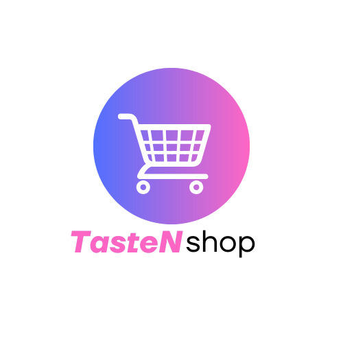

# The TasteNshop E-commerce Website
----

<a name="logo"/>
<div align="center">
</img>
</a>
</div>


# Introduction
-----

Welcome to the TasteNshop E-commerce website, a React-based application designed to offer a seamless shopping experience. 
This README provides a detailed guide for this codebase, how to set it up, and the key components that make up the application.

## Table of Contents
1. Project Overview
2. Features
3. Project Structure
4. Prerequisites
5. Components
- Navbar
- Home
- Details
- Cart
- Footer
6. Styling
7. Future Enhancements
8. Contributing
9. License


## The Project Overview

- __TasteNshop__ is a modern e-commerce platform built with React.
- The app allows users to *browse products*, *add them to their cart*, and *manage their shopping experience efficiently*.
- The application is designed with performance in mind, providing a responsive and interactive user interface.

## Some Features

- __Product Browsing__: Users can browse through various products available on the platform.

- __Cart Management__: Add products from the cart, and view the cart's total cost.

- __Search Functionality__: Quickly search for products using the search bar.

- __Wishlist__: Save products for later on by adding them to a wishlist.

- __Responsive Design__: The application is fully responsive, ensuring a great user experience across devices.


## The Project Structure

__css__

TasteNshop/
│
├── public/
│   |_ index.html
│   
│
├── src/
│   ├── components/
│   │   ├── Navbar.js
│   │   ├── Home.js
│   │   └── Search.js
│   │   ├── Details.js
│   │   ├── Cart.js
│   │   ├── Footer.js
│   │
│   ├── App.js
│   ├── App.css
│   |____ index.js
│   
│
├── package.json
├── README.md

## Prerequisites

To make sure this application does work, ensure you have the following installed on your machine:

- Node.js
- npm or yarn

## Installation

1. __Clone the repository__:
- git clone
```
git@github.com:Fixc-ray/e-commerce.git
```
2. __Navigate to the project directory__:

``
cd e-commerce
``

3. __Install the dependencies__:
- Copy code
```
npm install
```
or
```
yarn install
```

## Running the Application

- To start this development server, run:
```
npm start
```
or
```
yarn start
```

The application will be accessible at http://localhost:3000.


## Components

### Navbar

- File: `src/components/Navbar.js`.

- Description: The *Navbar* component provides the navigation bar for the application, including the logo, main menu items, a profile icon, and a wishlist link. 
It also includes a *theme toggle feature*.

### Home
- File: `src/components/Home.js`.

- Description: The `Home` component fetches and displays the list of products.
It also integrates the `Search` component to allow users to search for products.

### Details

- File: `src/components/Details.js`.

- Description: The `Details` component displays the product details, including name, description, price, and category.
It also handles adding items to the cart.

### Cart

- File: `src/components/Cart.js`.

- Description: The `Cart` component displays the items added to the cart, calculates the total price, and allows users to remove items from the cart.

### Footer

- File: `src/components/Footer.js`.

- Description: The `Footer` component provides additional information about the website, including an __"About Us"__ section and contact information.

### Styling
- File: `src/App.css`.

- Description: The primary `CSS` file for styling the application.
 It also includes styles for layouts, colors, and a responsive design.

- Footer Styling: The footer is styled with a dark background and light text to create a modern look. 
Icons are styled using Font Awesome.


## Future Enhancements

- __User Authentication__: Implements user authentication for a personalized shopping experience.

- __Payment Integration__: Integrate a payment gateway to facilitate online transactions.

- __Product Reviews__: Allow users to leave reviews and ratings for products.


## Contributions

- Contributions are all Welcome!! :)

- Please fork the repository and create a pull request with your changes. 

- Ensure that your code follows the project's coding standards and includes appropriate documentation.

This application was coded and compiled by:
[Ray](https://github.com/Fixc-ray),
[Keith](https://github.com/Umbrellaisnothere),
[Bridget](https://github.com/Br3dget),
[Margaret](https://github.com/Margaret617)

----