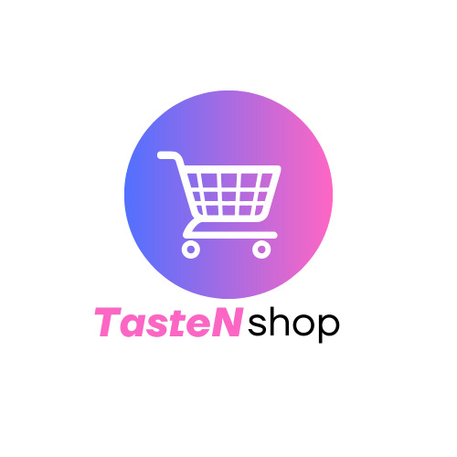

# The TasteNshop E-commerce Platform
----

- This is the live server link: https://e-commerce-chi-one-94.vercel.app/

<div align-items="center">
</img>
</div>


# Introduction
-----

Welcome to the TasteNshop E-commerce website that provides a complete shopping experience with a secure Back-End server for handling requests,Database management, and secure user interactions.

This README provides a detailed guide for this codebase, how to set it up, Back-End API endpoints, and the key components that make up the application.

## Table of Contents
1. Project Overview
2. Features
3. Project Structure
4. Prerequisites
5. Components
6. Styling
7. Future Enhancements
8. Challenges
9. Solutions
10. Contributions
-----


## The Project Overview

- __TasteNshop__ is a scalable e-commerce platform with a robust Back-End API built with React and Python.
- The app allows users to *browse products*, *add them to their cart*, and *manage their shopping experience efficiently*.

- Designed with performance and security in mind, TasteNshop offers a responsive UI and a reliable backend to handle data storage and user authentication.

## Some Features

- __Product Browsing__: Users can browse through various products available on the platform.

- __Cart Management__: Add products from the cart, and view the cart's total cost.

- __Search Functionality__: Quickly search for products using the search bar.

- __Wishlist__: Save products for later on by adding them to a wishlist.

- __Responsive Design__: The application is fully responsive, ensuring a great user experience across devices.

## Backend Features
- __Product Management__: Manage the product catalog, including adding, updating, and deleting products.

- __Cart and Wishlist Management__: Enable adding items to the cart and wishlist, as well as updating or removing items.

- __User Authentication__: Login and registration endpoints for secure user sessions.

- __Data Validation__: Ensures valid data entry for products, user details, and order information.

## The Project Structure

__css__

TasteNshop/
│
├── public/
│   |_ index.html
│   
│
├── src/
│   ├── components/
│   │   ├── Navbar.js
│   │   ├── Home.js
│   │   └── Search.js
│   │   ├── Details.js
│   │   ├── Cart.js
│   │   ├── Footer.js
│   │
│   ├── App.js
│   ├── App.css
│   |____ index.js
│   
│
├── package.json
├── README.md

## Prerequisites

To make sure this application does work, ensure you have the following installed on your machine:

- Node.js
- Pipenv
- npm or yarn
- Python { Flask }

## Installation

1. __Clone the repository__:
- git clone
```
git@github.com:Fixc-ray/e-commerce.git
```
2. __Navigate to the project directory__:

```
cd <name of the directory>
```

3. __Install the dependencies__:
- Copy code

```bash
npm install
```
or
```bash
pipenv install
```
or
```bash
yarn install
```

Set up environment variables

## Running the Application

- To start this development server, run:
```
npm start
```
or
```
yarn start
```

The application will be accessible at http://localhost:3000.

- Create a `.env` file in the Back end directory with the following environment variables, for example:
```bash
echo "DATABASE_URL=mongodb://localhost:27017/tasten_shop" > .env
echo JWT_SECRET= "your_secret_key" >> .env
PORT=5000 (or your preferable port to use)
```
- Run the Back End server:
```bash
npm run server
```

## Back End API endpoints
__Authentication Routes__

- __POST /api/register__: Register a new user
- __POST /api/login__:
Authenticate a user and generate a JWT token

__Product Routes__
- __GET /api/products__: Get a list of all products
- __POST /api/products__: Create a new product (Admin only)
- __PUT /api/products/__
: Update a specific product **(Admin only)**
- __DELETE /api/products/__
: Delete a specific product **(Admin only)**

__Cart Routes__

- __GET /api/cart__: Get user’s cart items
POST /api/cart: Add a product to the cart
- __DELETE /api/cart/__
: Remove a product from the cart

__Wishlist Routes__

- __GET /api/wishlist__: Get user’s wishlist items
- __POST /api/wishlist__: Add a product to the wishlist
- __DELETE /api/wishlist/__
: Remove a product from the wishlist


## Components (FRONT END)

### Navbar

- File: `src/components/Navbar.js`.

- Description: The *Navbar* component provides the navigation bar with a logo, main menu items, a profile icon, and a wishlist link. 
It also includes a *theme toggle feature*.

 __Profile Component__: In Profile.js, users can enter their credentials to log in securely or register for a new account.
 
 This integration provides a smooth transition from navigation to authentication, enhancing user experience across devices.

### Home
- File: `src/components/Home.js`.

- Description: The `Home` component fetches and displays the list of products.

- It also integrates the `Search` component to allow users to search for products for quick access.

### Details

- File: `src/components/Details.js`.

- Description: The `Details` component displays the product details, including name, description, price, and category.

- It also handles adding items to the cart.

### Cart

- File: `src/components/Cart.js`.

- Description: The `Cart` component displays the items added to the cart, calculates the total price, and allows users to remove items from the cart.

### Footer

- File: `src/components/Footer.js`.

- Description: The `Footer` component provides additional information about the website, including an __"About Us"__ section and contact information.

### Styling
- File: `src/App.css`.

- Description: The primary `CSS` file for styling the application.
 It also includes styles for layouts, colors, and a responsive design.

- Footer Styling: The footer is styled with a dark background and light text to create a modern look. 
Icons are styled using Font Awesome.


## Backend Improvements

New Functionalities and Enhancements

__User Authentication__:
- __JWT Intergration__: A secure login and token-based authentication, provides a smooth and secure user experience.

- __Protected Routes__: Only authenticated users can access certain parts of the app, such as adding to the cart or wishlist.


__Cart and Wishlist Management__:

- Products can now be securely added, removed, or updated in a user’s cart or wishlist, allowing a seamless shopping flow.


__Enhanced Error Handling__:

- Consistent error responses with HTTP status codes and descriptive messages to guide users and prevent unwanted errors.


__Data Validation__:

- The implemented data validation to ensure all inputs are valid, for example, `required fields for product creation and valid formats for user email and password.`

__Refined Database Models__:

- Enhanced schemas to support relationships and optimized indexing for faster product lookups and data retrieval.


## Future Enhancements

- __Real-Time Cart Updates__: Synchronized across devices.

- __Advanced Payment Integration__: Supporting credit cards and wallets.

- __Product Recommendations__: Personalized suggestions based on browsing and purchase history.

- __User Authentication__: Implements user authentication for a personalized shopping experience.

- __Payment Integration__: Integrate a payment gateway to facilitate online transactions.

- __Product Reviews__: Allow users to leave reviews and ratings for products.

- A greeting animation that will be configured for the users to see Logged in or not. 

- There also are categories and Services which we had plans for. (Subscriptions for over the top features)

- We would also like to have a feature that supports flash sales and also discounted weeks adopting the famous **Black Friday**


### Challenges 

- __CORS Integration__: Setting up secure backend connections.

- __Route Protection__: Adding security for all app routes.

- __Data Seeding__: Ensuring seed data aligns with database models.

- __CSS Conflicts__: Balancing TailwindCSS with custom styles.

- The profile at the Navbar was intended to have been linked with a component called Profile.js where the user can be linked to a UI to login their credentials while having the possibility to create an account. 

We will try to make sure that this problem will be solved as soon as possible.


## Solutions

- Dark Mode Toggle: Successfully implemented a toggle to switch between light and dark themes.

- The add to cart function was finally fixed as stated in the Challenges section above.

- We were able to make the profile have a function attached to it but it is to be improved later on so it can have an uploaded picture of a user. 
(The image should be up to standard with the size of the profile container and should `NOT` have any graphical content that can harm or disturb the page.)


## Contributions

- Contributions are all Welcome!! :)

- Please fork the repository and create a pull request with your changes. 

- Ensure that your code follows the project's coding standards and includes appropriate documentation.


This application was coded and compiled by:
[Ray](https://github.com/Fixc-ray),
[Keith](https://github.com/Umbrellaisnothere),
[Bridget](https://github.com/Br3dget),
[Margaret](https://github.com/Margaret617)

----